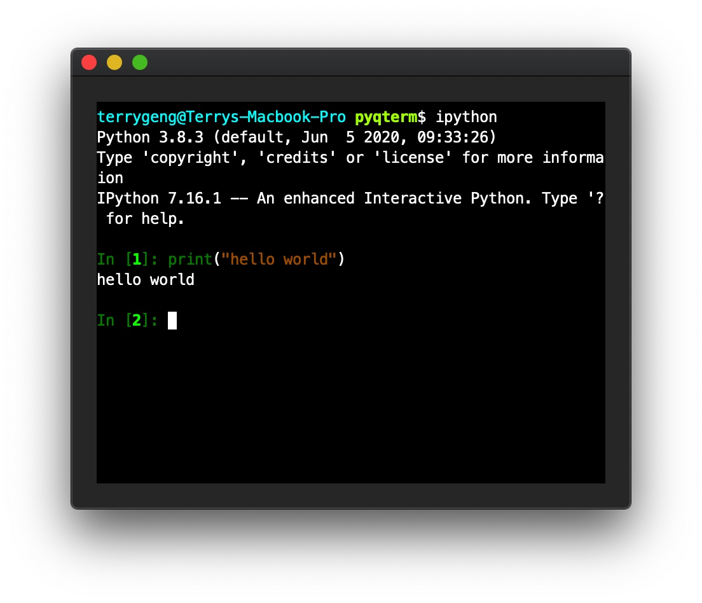

# termqt

_termqt_ is the python implementation of a terminal emulator, based on Qt. It
is designed to be embedded as a widget in other programs. It implements a
subset of the functions described in [VT100 User
Guide](https://vt100.net/docs/vt100-ug/chapter3.html) and [XTerm Control
Sequence](https://invisible-island.net/xterm/ctlseqs/ctlseqs.html). While can't
be considered as a fully functional terminal emulator like those most used by
people, it can run IPython and perhaps more complicated applications.



## Dependencies

- Python 3.5+ (to get PyQt5 running),
- PyQt5 /PyQt6 / PySide2 / PySide6.

## Installation

```bash
pip install termqt
```

## Get Started

_termqt_ is divided into a `Terminal` widget that can be embedded in any Qt
program, and a `TerminalIO` that is used to communicate with child processes
like `bash` or `ipython`. One has to connect all callbacks inside `Terminal`
and `TerminalIO` in order to get them running. One may also build his own
`TerminalIO` backend instead of using the existing ones.

A quick minimalistic example can be found in `start.py`. It creates a
`Terminal` and a `TerminalExecIO` that runs `bash` under Linux (and other
POSIX-compatible environments) or `cmd` under Windows.

## Issues / Feature Requests

If you spot a bug or want to propose a feature, please feel free to submit an
issue. At this time, my time working on this project is not guaranteed, but I
will try my best. Other volunteers are also welcomed to submit PRs. All your
efforts are appreciated!

